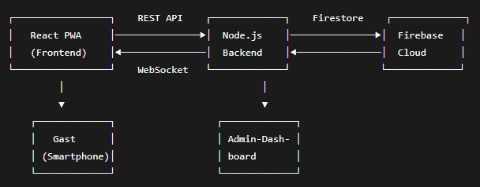

***
[Zurück zu README.md](../../README.md)
***
# Soll-Konzept & Architekturentwurf (1 Stunde)

* Ergebnis: Systemarchitektur und technisches Konzept
    
* Soll-Prozesse:
    > Gast stellt Anfrage → PWA sendet an Backend → Backend speichert in Firestore → Rezeption sieht Anfrage im Dashboard → Rezeption weist zu → Abteilung erhält Benachrichtigung → Abteilung markiert als erledigt → Gast erhält Bestätigung
   
* Systemarchitektur:

    

* Technologie-Stack Festlegung: 
    * Frontend: React + TypeScript + Vite (PWA)
    * UI-Framework: Material-UI (MUI)
    * Backend: Node.js + Express.js
    * Datenbank: Firebase Firestore (NoSQL)
    * Authentifizierung: Firebase Auth
    * Echtzeit-Kommunikation: Socket.io
    * Deployment: Docker + Google Cloud Run